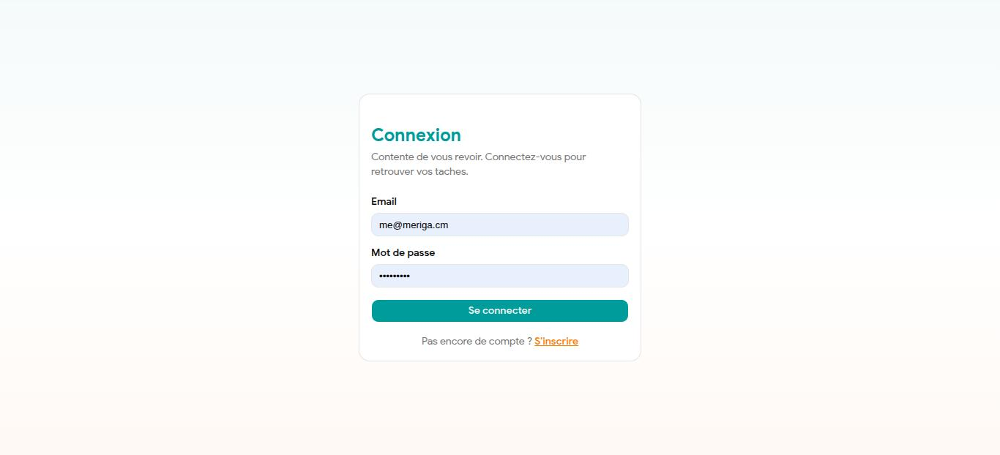
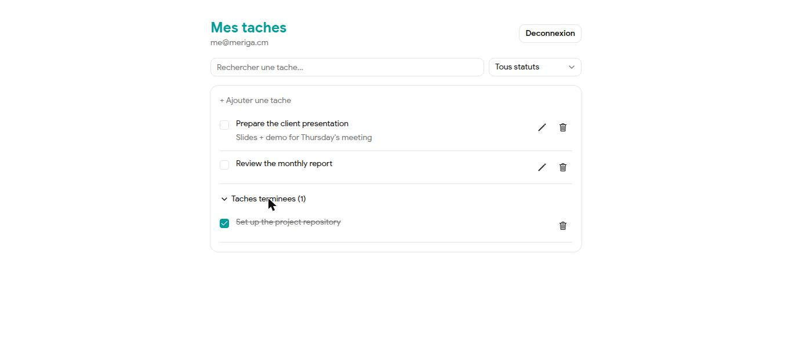
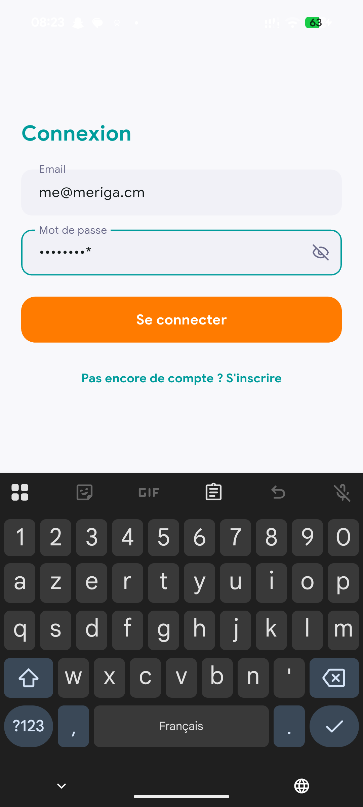
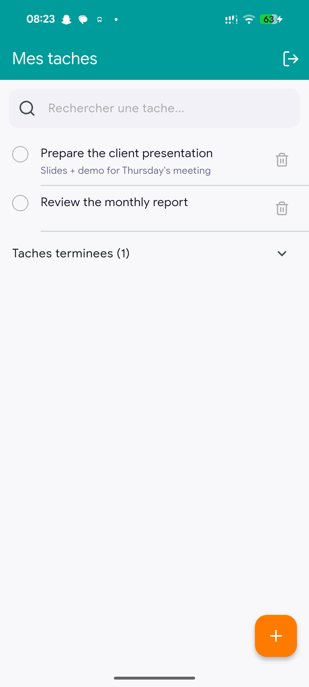
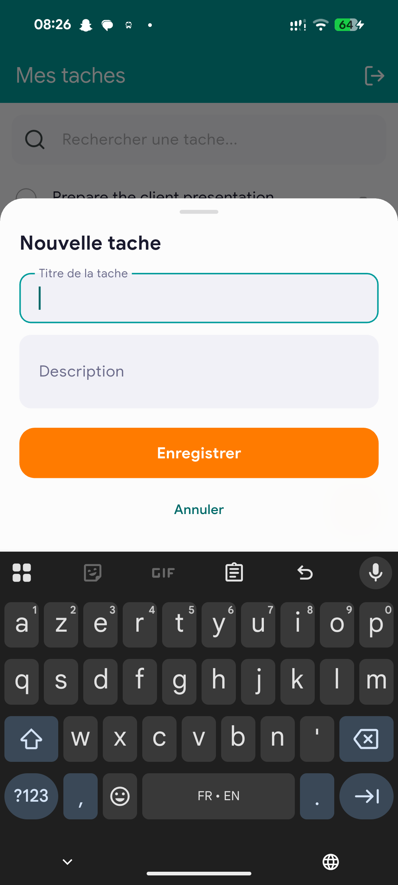
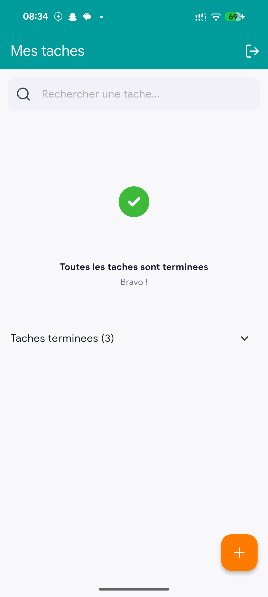

# Task Manager

A task management app: create an account, add/edit/delete tasks, filter by
status and search, with web and mobile synced through a single Spring Boot
API.

## Live demo

- Web: https://taskmanager.meriga.cm
- API: https://api.taskmanager.meriga.cm
- Mobile (Android APK): [Release v1.0.0](https://github.com/Agirem/task-manager/releases/tag/mobile-v1.0.0)

## Screenshots

**Web**

| Login | Task list |
|---|---|
|  |  |

**Mobile**

| Login | Task list | New task (bottom sheet) | All tasks done |
|---|---|---|---|
|  |  |  |  |

## Tech stack

| Area     | Technologies |
|----------|--------------|
| Frontend | React 19 + Vite + TypeScript + Tailwind CSS |
| Backend  | Java 21 + Spring Boot 4 + Spring Data JPA + Spring Security (JWT) + MySQL |
| Mobile   | Flutter + Dart, dev/prod flavors, dio, flutter_secure_storage |
| CI/CD    | GitHub Actions -> Docker -> Google Cloud Run + Cloud SQL |

## Architecture

```
task-manager/
├── backend/    Spring Boot REST API (see backend/README.md)
├── frontend/   React SPA (see frontend/README.md)
├── mobile/     Flutter app, Android/iOS (see mobile/README.md)
├── docker-compose.yml   Runs mysql + backend + frontend locally
└── .github/workflows/ci-cd.yml   CI/CD pipeline to GCP
```

The backend exposes a stateless REST API (JWT), consumed independently by the
web frontend and the mobile app. Each client manages its own token storage
(localStorage on web - simpler than an httpOnly cookie, though slightly less
resistant to XSS; Keychain/Keystore via flutter_secure_storage on mobile) and
calls the same endpoints.

### API endpoints

| Method | Route | Description |
|---|---|---|
| POST | `/api/auth/register` | Register |
| POST | `/api/auth/login` | Log in (returns a JWT) |
| GET | `/api/tasks` | List the logged-in user's tasks (`status`, `search` filters) |
| POST | `/api/tasks` | Create a task |
| PUT | `/api/tasks/{id}` | Update a task |
| DELETE | `/api/tasks/{id}` | Delete a task |

## Running locally

### Option 1: Docker Compose (simplest)

```bash
docker compose up --build
```

Starts MySQL, the backend (`:8080`) and the frontend (`:5173`) together.

### Option 2: run each service manually

See each folder's README: [`backend/`](backend/README.md),
[`frontend/`](frontend/README.md), [`mobile/`](mobile/README.md).

## CI/CD

On every push to `main`, `.github/workflows/ci-cd.yml`:

1. builds and tests the backend (against an ephemeral MySQL) and the
   frontend in parallel;
2. builds the backend/frontend Docker images and pushes them to Artifact
   Registry;
3. deploys both services to Cloud Run, with the backend connecting to
   Cloud SQL through the native connector (no public IP exposed).

## Notable technical choices

- **CORS and API URL are configurable** via environment variables
  (`CORS_ALLOWED_ORIGINS`, `VITE_API_URL`, mobile's `API_BASE_URL`): the same
  code runs locally, in Docker, and in production without changes.
- **Optimistic UI** on task create, edit, delete, and status toggle (web and
  mobile): the UI updates immediately, then reconciles with the server or
  rolls back if the API call fails.
- **Cloud SQL via the native connector** instead of a public IP: the Cloud
  Run backend talks to Cloud SQL over an internal Google socket, with no
  database port exposed to the internet.
- **Mobile release builds are obfuscated** (`--obfuscate
  --split-debug-info`) with ProGuard/R8 enabled on Android (see
  `mobile/README.md`).
